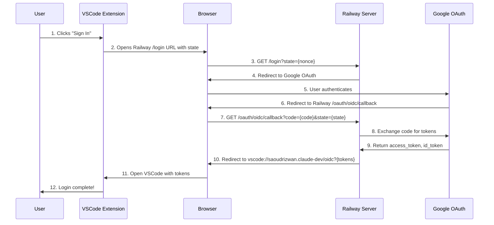

# OAuth Server-Handled Flow

## Overview

This implementation delegates the entire OAuth flow to the Railway server, making the VSCode extension simpler and more secure.

## Flow Diagram



## Implementation Details

### VSCode Extension (AuthService.ts)

```typescript
// When user clicks sign in
const serverLoginUrl = `${this._config.URI}/login?state=${encodeURIComponent(this._authNonce)}`
await vscode.env.openExternal(vscode.Uri.parse(serverLoginUrl))
```

### Railway Server Endpoints

1. **GET /login**
   - Receives: `state` parameter from VSCode
   - Action: Redirects to Google OAuth with proper params
   - Redirect URL includes Railway's callback URL

2. **GET /oauth/oidc/callback**
   - Receives: `code` and `state` from Google
   - Actions:
     - Exchanges code for tokens using client_secret
     - Validates ID token
     - Constructs VSCode URI with tokens
   - Redirect: `vscode://saoudrizwan.claude-dev/oidc?access_token=...&id_token=...&state=...`

### VSCode Extension (extension.ts)

The extension's URI handler already listens for `/oidc` callbacks:

```typescript
case "/oidc": {
    // Parse tokens from query parameters
    const accessToken = query.get("access_token")
    const idToken = query.get("id_token")
    // ... handle tokens
}
```

## Security Benefits

1. **Client Secret Protection**: The `client_secret` never leaves the server
2. **Token Validation**: Server validates tokens before passing to VSCode
3. **Simplified Extension**: Extension doesn't need OAuth logic
4. **Centralized Auth**: Easy to add logging, monitoring, or change providers

## Environment Variables (Railway)

Required on your Railway server:
- `CLIENT_ID`: Your Google OAuth client ID
- `CLIENT_SECRET`: Your Google OAuth client secret
- `APP_BASE_URL`: Your Railway app URL (e.g., https://server-production-f0ec.up.railway.app)
- `VSCODE_EXTENSION_ID`: saoudrizwan.claude-dev (already set as default)
- `USE_DIRECT_REDIRECT`: true (for automatic redirect)

## Testing the Flow

1. Clear any existing auth state:
   - Run command: `Cline: Force Logout (Debug)`

2. Click "Sign In" in VSCode
   - Should open: `https://server-production-f0ec.up.railway.app/login?state=...`

3. Complete Google OAuth

4. Verify redirect to VSCode
   - Check Developer Console for "OIDC callback received" log

## Troubleshooting

If the flow doesn't complete:

1. **Check Railway Logs**
   ```bash
   railway logs
   ```

2. **Verify Environment Variables**
   - Ensure all required vars are set in Railway dashboard

3. **Check VSCode Console**
   - Look for "AuthService:" logs
   - Look for "OIDC callback received:" logs

4. **Test Direct Redirect**
   - Visit: `https://server-production-f0ec.up.railway.app/`
   - Should show "OIDC Callback Server is running" 